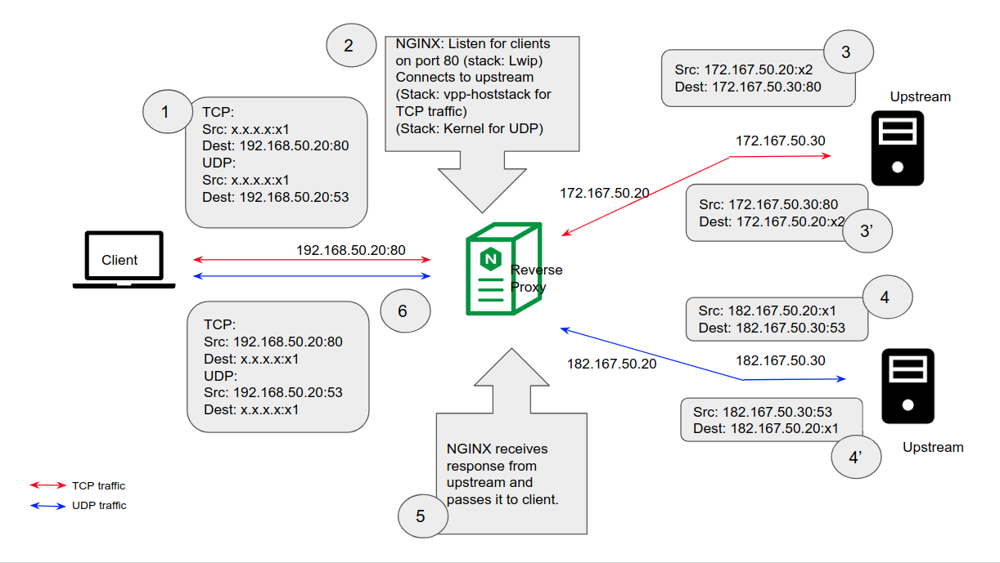
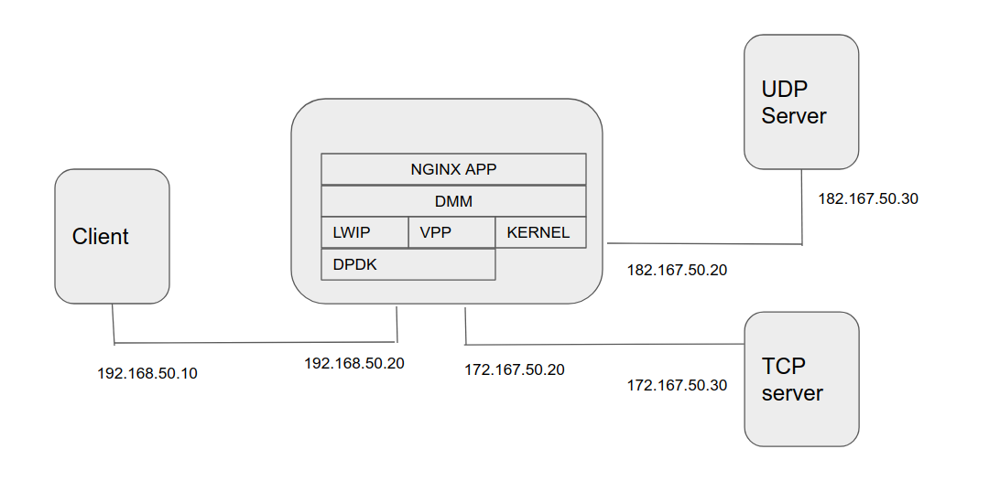

#demo-2
## Introduction
This demo NGINX as a reverse proxy server. The server uses "lwip" for client facing socket and "kernel tcp/ip stack "
as upstream server facing socket for UDP, "vpp-hoststack" for another updtream server facing stack for TCP.

## Topology


## Steps
####1. Create VMs using vagrant.
Start demo VMs. Go to dmm/demo/nginx_proxy/demo-2 .
```
$ vagrant up
```
This command will create 4 VMs namely rproxy-client, rproxy-server1, rproxy-server2 and rproxy-proxy. The memory
requirement for this demo is 13GB (approx).

####2. Log in to VMs
Open four terminal and login to VMs.
```
$ vagrant ssh <vm-name>
```

####3. Run Udp server Application at rproxy-server2
```
$ vagrant ssh rproxy-server2
Inside VM
vagrant@rproxy-server2:~$ sudo su
root@rproxy-server2:/home/vagrant# cd /UDPSERVER/
root@rproxy-server2:/UDPSERVER# ./udpserver
```

####4. Run NGINX proxy server at rproxy-proxy
```
$ vagrant ssh rproxy-proxy
Inside VM
vagrant@rproxy-proxy:~$ sudo su
root@rproxy-proxy:/home/vagrant# cd /DMM/thirdparty/apps/nginx/release
root@rproxy-proxy:/DMM/thirdparty/apps/nginx/release# export LD_LIBRARY_PATH=/DMM/stacks/lwip_stack/release/lib64
root@rproxy-proxy:/DMM/thirdparty/apps/nginx/release# ./nginx
```
####5. Test TCP traffic
```
$ vagrant ssh rproxy-client
vagrant@rproxy-client:~$ cd /CLIENT/
vagrant@rproxy-client:/CLIENT$ curl http://192.168.50.20
Hello from upstream rproxy-server1 172.167.50.30:80. Connect from  -  via 172.167.50.20:15140 at [12/Nov/2018:06:17:25 -0800] GET / HTTP/1.1 200 0  curl/7.47.0

```

####6. Test UDP traffic
```
$ vagrant ssh rproxy-client
vagrant@rproxy-client:~$ cd /CLIENT/
vagrant@rproxy-client:/CLIENT$ curl http://192.168.50.20
Hello message sent.
Server : Hello from server
```
#### Notes:
a. If enable debugs i.e. export NSTACK_LOG_ON=DBG before we run nginx in rroxy-proxy we can find below logs which suggest we use diffrent stack for diffrent ip/protoccol.
```
...
nstack_bind<NSSOC>fd addr Select module]fd=18,addr=192.168.50.20,module=lwip
...
nstack_bind<NSSOC>fd addr Select module]fd=22,addr=172.167.50.20,module=vpp_hoststack
...
nstack_bind<NSSOC>fd addr Select module]fd=22,addr=182.167.50.20,module=kernel
```
b. This demo depends on commit of dmm. Please check commit version of your code.