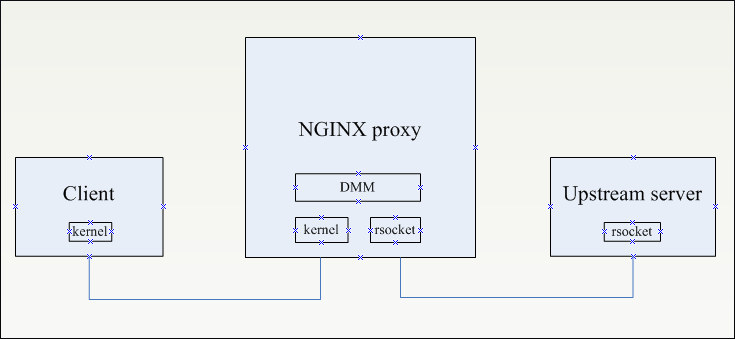

# Demo: NGINX working with multi-stack using DMM

In above diagram NGINX box in the middle is working as reverse proxy.
One of the NIC ( client facing) is using kernel tcp/ip stack whereas the
other NIC is connected to upstream server using rsocket tcp/ip stack.

you can use test.c to compile a server depend on libnStackAPI.so. It bind the
port 8888 by default and you can change it to other port. Then copy the
module_config.json rd_config.json to the folder of server. Then you can start the
server as follow:
./server 162.128.1.16

####More Information:
https://wiki.fd.io/view/DMM
https://www.nginx.com/blog/ip-transparency-direct-server-return-nginx-plus-transparent-proxy/

