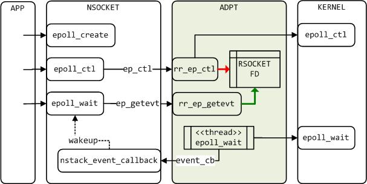

# 1. What is rsocket
Rsockets is a protocol over RDMA that supports a socket-level API for
applications.
The dmm_rsocket adapted to DMM based on the librdmacm 1.1.0 version make it a
protocol in DMM framework.

# 2. How to use DMM-rsocket

## How to integrate rsocket into DMM

The file CMakeList.txt defined the compiling process, including downloading
librdmacm 1.1.0 and patch it with rsocket.patch. The patch will
modify the related files when necessary, and finally provide
library of "libdmm_rdmacm.a" and "libdmm_rsocket.so".

Target 'dmm_rsocket' could not be get automatically unless you run 'make dmm_rsocket' manually.
'make dmm_rsocket' will compile the adaption code and linking with libdmm_rdmacm.a.



## Compile
(refer to dmm/doc/Build_DMM.md)
```sh
    #cd dmm/build && cmake ..
    #make help
    #make dmm_rsocket
```
Note:
  After these processes, libdmm_rsocket.so protocol module would be created in
dmm/release/lib64/libdmm_rsocket.so

## Test
- Steps 1: update some environment variables
```sh
	#export LD_LIBRARY_PATH=${dmm}/release/lib64
	#export LD_PRELOAD=${dmm}/release/lib64/libnStackAPI.so
	#export NSTACK_MOD_CFG_FILE=${dmm}/stacks/rsocket/configure/module_config.json
	#export NSTACK_MOD_CFG_RD=${dmm}/stacks/rsocket/configure/rd_config.json
```
- Steps 2: Modify rd_config.json(located at dmm/stacks/rsocket/configure/)
```sh
	#vim rd_config.json
	  //set "subnet": "192.168.21.1/24"
```
Note:
  Means dmm will hijack data from subnet 192.168.21.*

- Steps 3: Communication test between machine A(as server) with machine B
		(as client)

##### Run in machine A
```sh
	#./dmm/release/bin/vs_epoll -p 20000 -d 192.168.21.180 -a 10000 -s 192.168.21.181 -l 1000 -t 500000 -i 0 -f 1 -r 20000 -n 1 -w 10 -u 50000 -e 10 -x 1
```
Note:
  Means the current machine would be server, and it's
destination address is 192.168.21.180 (client address),
source address is 192.168.21.181(server address)

##### Run in machine B
```
	#./dmm/release/bin/vc_common -p 20000 -d 192.168.21.181 -a 10000 -s 192.168.21.180 -l 1000 -t 500000 -i 0 -f 1 -r 20000 -n 1 -w 10 -u 50000 -e 10 -x 1
```
Note:
  Means the current machine would be client, and it's
destination address is 192.168.21.181 (server address),
source address is 192.168.21.180(client address)

# 3. Document description

(dmm/stacks/rsocket)

## CMakeLists.txt
Control file for Cmake compiling.

## config folder
##### module_config.json
- module_config.json is for configuring dmm protocol stack module

##### rd_config.json
- rd_config.json is to choose which module is better to go through. It will go
	through rsocket protocol stack when RD type is nstack-rsocket

## rsocket.patch
For the librdmacm patch, the key modification is to find the point where the
epoll event is executed, all using the DMM_RSOCKET macro control.
Other changes are to package the hijacked API, so that the code can calls
libc API directly to avoid calls to the hijacked functions in the DMM,
all using GSAPI macro control.

## src folder
##### rsocket_adpt.c && rsocket_adpt.h
- Rsocket adaptation section, including initialization and adaptation functions.

##### rsocket_rdma.h
- Public header file.

##### rsocket_in.h && rsocket_rs.c
- rsocket_in.h is included in rsocket.c.(rsocket.c is located at
	dmm/stacks/rsocket/librdmacm-1.1.0/src)
- rsocket_rs.c is embedded at the end of rsocket.c

##### rsocket_sapi.h
- List of libc functions which only be used internally.

# 4. More Information
https://wiki.fd.io/view/DMM
https://github.com/ofiwg/librdmacm/blob/master/docs/rsocket
https://github.com/rsocket/rsocket
http://www.mellanox.com/page/products_dyn?product_family=26
